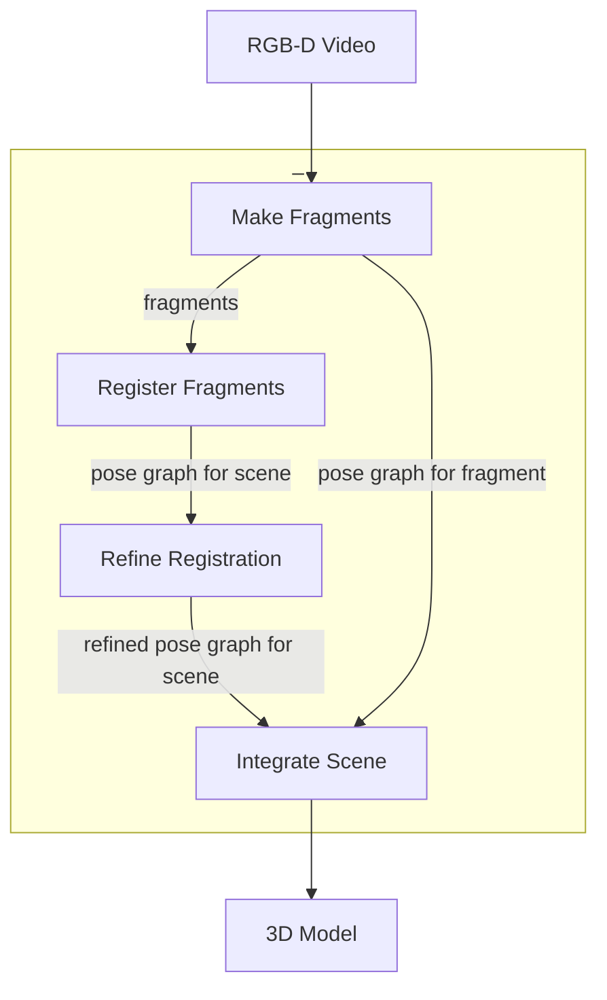

# Open3Dの三次元再構成システムの解説
## はじめに
私はOpen3Dの三次元再構成システムを詳しく勉強する機会がありました。[Open3Dの三次元再構成システムについての公式ドキュメント](http://www.open3d.org/docs/release/tutorial/reconstruction_system/index.html)は基本的な画像処理やSLAMの知識を前提に書かれているので、そのような背景知識が少ない人はその公式ドキュメントを読んでも理解するのが難しいと思います。そこで私は公式ドキュメントの中身を補足するような記事を書こうと思いました。それでは本編に移りたいと思います。

## Open3Dと三次元再構成システムの関係
三次元再構成とはセンサーの出力を用いて三次元モデルを作成する技術のことである。Open3Dは3Dデータを処理するソフトウェアの高速な開発をサポートするオープンソフトソフトウェアである[1]。Open3D v0.15.1には三次元再構成システム(3D Reconstruction System)は2種類含まれている。Legacy 三次元再構成システムとTensor　三次元再構成システムである。Legacy　三次元再構成システム[2]でも言及されているOpen3Dが公開された当初から実装されている三次元再構成システムである。このシステムはloop closureを検知するが、GPU実装がされていないため、処理速度が遅い欠点がある([3]がGPU実装を提案しているが、Open3Dのmasterブランチに反映されているのは、scene integration processのみで、システム全体の高速化にはわずかにしか寄与しない)。一方でtensor 三次元再構成システム[4]は、GPU実装がされており、高速であるがloop closureが検知されない欠点がある。本記事ではlegacyの三次元再構成システムについて解説する。

## 三次元再構成システムの概要
Open3Dの三次元再構成システムはRGB-D動画から三次元モデルを生成する。RGB-D画像とは同一タイミングで撮影した色画像と深度画像の対からなる画像のことである。つまりRGB-D画像は色画像の画素それぞれに奥行きが付いたデータとなる。このRGB-D画像を時系列順に並べたものがRGB-D動画となる。このシステムのパイプラインは[5]を基に[6]のアイディアをいくつか導入して構築されている。

内部では以下の4つの工程を経てRGB-Dの動画から三次元モデルを作成する。
1. Make Fragments
入力のRGB-D画像列（動画）から部分画像列を作成し、部分画像列内の画像の相対位置を推定し、部分画像列からfragmentと呼ばれる部分シーンを作成する。
2. Register Fragments
fragmentをloop closureを検知するためにglobal空間に配置する。
3. Refine Registration
大雑把な位置合わせをより密にする。
4. Integrate Scene
RGB-D画像をシーンのメッシュモデルを生成するために統合する。

Figure1. システムの各工程と入出力の概要図

Open3Dの公式ドキュメントで利用されているサンプルのRGB-D動画はSceneNN 016と呼ばれるものである。

Figure2. SceneNN 016のRGB画像から作成したGIF

## Make Fragments
この工程では入力のRGB-D動画から部分画像列を作成し、その部分画像列内の画像同士の位置推定をし、その推定結果を部分画像列ごとに保存し、部分画像列ごとにfragmentと呼ばれる部分的なシーンを作成する。この処理はBatch Processingによって部分画像列ごとに処理がなされ、並列化される。[5]は入力の画像列から部分画像列を作成するのは、信頼できる局所幾何を作成するためと言っている。

### 部分画像列の作成
具体的な処理として、まず入力の画像列を一定の枚数で分割し、部分画像列を作成する。画像列における$k$番目のRGB-D画像を$I_k$とする。このとき入力のRGB-D画像列(動画)は次のように表される。

$$
I_k \in \bm{\mathcal{I}}
$$

画像列の$i$番目から$j$番目を抽出した部分画像列は次のように定義される。

$$
\bm{\mathcal{I}}_{i:j} = \{I_i, \dots, I_j\} \subset \bm{\mathcal{I}} (i < j \in \mathbb{N})
$$

$i$番目から$j$番目の画像からなる部分画像列$\bm{\mathcal{I_{i:j}}}$が$k$番目の部分画像列であるとき、部分画像列を$S_k = \bm{\mathcal{I_{i:j}}}$と表現する。

### 部分画像列内の画像同士の位置推定
次に部分画像列ごとに、部分画像列$S_k$内に含まれる任意の2枚の画像を組み合わせて画像対$(I_s, I_t) (i \leq s \lt t \leq j)$を作成する。画像対に含まれる一方の画像をsource画像$I_s$、もう一方をtarget画像$I_t$とする。この画像対に含まれるsource画像に対するtarget画像の相対位置を推定する。三次元座標上におけるsource画像$I_s$とtarget画像$I_t$の位置を同次座標表現で$\bm{I}_s, \bm{I}_t \in \mathbb{R^4}$とする。このときsource画像の座標$\bm{I}_s$をtarget画像の座標$\bm{I}_t$に近づける移動行列$\bm{T}^{i} \in \mathbb{{R^{4\times4}}}$を計算する目的関数$E(\bm{T}^i)$を定義する。

$$
E(\bm{T}^i) = \|\bm{T}^{i}\bm{I}_s -\bm{I}_t\|
$$

source画像とtarget画像が時間的に隣接する場合($s - t = 1$のとき)と時間的に非隣接な場合($s - t \neq 1$のとき)は異なる処理で画像の位置を推定する。前者の場合はodometryを推定し、後者の場合はloop closureを検知する。odometryは推定されたカメラの軌跡を意味する。時間的に隣接する画像はカメラの撮影位置が空間的に近いという仮定が成り立つため、odometryは時間的に隣接する画像同士の相対位置を`compute_rgbd_odometry`で推定し、帰納的に計算することでカメラの軌跡を計算することができる。つまり$k$番目の画像を撮影したカメラの位置$\bm{T}^{c}_k$は次のように表される。

$$
\bm{T}^{c}_{k} = \bm{T}^{i}_{k}\bm{T}^{i}_{k-1}\dots \bm{T}^{i}_{0} \\
\bm{T}^{i}_{0} = \bm{E} \in \mathbb{R^{4\times4}}
$$

odometryは一般的に長い距離を推定すればするほど誤差が蓄積することが知られており、これをpose driftと呼ぶ。そこでカメラが一周して同じ点を観測することでpose driftを減らす[7]。これをloop closureと呼ぶ。loop closureの場合、wide baseline matchingで（実装ではOpenCV ORB特徴点を抽出し、5点RANSACで大雑把に位置合わせする）得られた状態を初期値とし、`compute_rgbd_odmetry`で非隣接の画像同士の相対位置を推定する。source画像$I_s$とtarget画像$I_t$の相対位置を`register_one_rgbd_pair`で推定することで、source画像をtarget画像に揃える移動行列(transformation matrix) $\bm{T}^i$、情報行列(information matrix) $\Lambda$、そして相対位置推定に成功したか否かのフラグを返す。情報行列とは目的関数を最適化する際に繰り返し使われる定数行列のことである。source画像$I_s$とtarget画像$I_t$の共通の特徴点を対応(corresponding) $(\bm{p}, \bm{q})$とし、その集合を$(\bm{p}, \bm{q}) \in \mathcal{K}$とする。$\mathcal{K}$の要素である対応$(\bm{p}, \bm{q})$それぞれを計算し、その総和が情報行列$\Lambda$である。情報行列の詳細については[Open3Dの実装](https://github.com/isl-org/Open3D/tree/v0.15.1/cpp/open3d/pipelines/registration/Registration.cpp#L380-L429)とChoi2015の式(9)を参照のこと。

### 推定結果の保存
先の処理で得られた推定結果は`make_posegraph_for_fragment`で部分画像列ごとにpose graphというグラフに保存される。Open3Dの3次元再構成システムにおけるpose graphはある時刻ごとの物体(画像もしくはfragment)の位置をnodeとして、node間の相対位置を表す移動行列と情報行列をedgeとするグラフのことである。このMake Fragments工程ではnodeにはカメラの位置の逆行列$(T^c_k)^{-1}$、edgeには画像の移動行列$T^i_k$、情報行列$\Lambda_k$、信頼度(confidence)を持つpose graphを保存し、部分画像列ごとにpose graphは作成される。信頼度とは画像の相対位置を推定する目的関数$E(\bm{T}^i)$の推定結果がどれだけ信頼できるかを示す。実際には信頼度とは目的関数のline processという処理をするために加えた項$l_{\bm{p},\bm{q}}$の値($0 \leq l_{\bm{p},\bm{q}} \leq 1$)で、情報行列を用いて計算される。信頼度の詳細については[Open3Dの実装](https://github.com/isl-org/Open3D/tree/v0.15.1/cpp/open3d/pipelines/registration/GlobalOptimization.cpp#L143-L164)、[5]の式(2)、そして[8]の式(6)を参照のこと。odometryの場合、nodeとedgeがともに作成され、loop closureの場合、edgeのみが保存される。1つの部分画像列から生成されたpose graphは1つの空間を表し、これをfragment空間と呼ぶ。作成された1つのpose graphは1つのfragment空間と対応し、fragment空間ごとに原点の位置が異なる。以上の処理でpose graph `fragment_[\d]{3}.json`(正規表現)が得られれば`optimize_posegraph_for_fragment`を呼び、pose graphを最適化し、`fragment_optimized_[\d]{3}.json`を得る。

### fragmentの作成
部分画像列$S_k = \bm{\mathcal{I}}_{i:j}$から作成されたpose graphに含まれる画像$I_n(i \leq n \leq j)$をfragment空間における画像の位置$T^c_n$で、TSDF volumeに統合し、Marching Cube法でそのvolumeからmeshを抽出し、meshの頂点情報からfragmentと呼ばれる点群 $f_k (= \{\mathbb{R}^3\})$を作成する。

Figure3. Make Fragments工程で得られたfragmentの例

## Register Fragments
Make Fragments工程で得られたfragmentを1つのsceneのglobal空間に配置する。まず全てのfragmentの任意の2つの組み合わせでfragment対$(f_s, f_t) (s \lt t \in \mathbb{N})$を作成する。fragment対に含まれる一方のfragmentをsource fragment $f_s$、もう一方をtarget fragment $f_t$とする。三次元座標上におけるsource fragment $f_s$とtarget fragment $f_t$の位置を同次座標表現で$\bm{f}_s, \bm{f}_t \in \mathbb{R^4}$とする。fragment対に含まれるtarget fragment $f_t$に対するsource fragment $f_sの移動行列$\bm{T}^f$を推定する。このとき移動行列$\bm{T}^f$を推定するための目的関数を$E(\bm{T}^f$とすると、次のように表される。

$$
E(\bm{T}^f) = \|\bm{T}^{f}\bm{f}_s -\bm{f}_t\|
$$

目的関数$E(\bm{T}^f)$を求める前に、まず前処理としてfragmentである点群を間引き(down-sampling)し、法線を推定し、FPFH featureを計算する。FPFH featureとはOpen3Dの実装において33次元から成るベクトルのことで、query pointとその周りの点との位置関係を表す値をもつ特徴である。FPFH featureの詳細については[9]と[10]を参照のこと。画像対と同様にfragment対でもfragmentが隣接しているか、否かで適応する処理を変化させる。fragment対がodometryの場合($s - t = 1$のとき)、source fragmentとtarget fragmentがある程度空間的に近いという仮定が成り立つので、Colored Point Cloud Registration[6]、point to plane ICP、またはgeneralized ICPで目的関数を最適化する。fragment対がloop closureの場合、RANSACまたはFast Global Registration[8]を用いてglobal空間においてsource fragmentとtarget fragmentの大雑把な相対位置を推定する。本来であればsource fragmentとtarget fragmentが全く重なり合った範囲がなく、誤った相対位置を返す場合、これをfalse matchingと呼ぶ。Make Fragment工程と同様にsource fragmentとtarget fragmentの相対位置を推定することで、source fragmentをtarget fragmentに揃える移動行列$T^f$、情報行列$\Lambda_k$、そして相対位置の推定に成功したか否かのフラグを返す。global空間における$k$番目のfragmentの位置$\bm{T}^g_k$は次の帰納的な計算で求まる。

$$
\bm{T}^g_k = \bm{T}^f_k \bm{T}^{f}_{k-1}\dots \bm{T}_0 \\
\bm{T}^f_0 = \bm{E} \in \mathbb{R}^4
$$

global空間を表すpose graphはnodeにfragmentの位置の逆行列$(\bm{T}^g_k)^{-1}$、edgeにfragmentの移動行列$\bm{T}_k$と情報行列$\Lambda_k$を保存する。得られた結果は`global_pose_grpah.json`と`global_pose_grpah_optimized.json`に保存される。

## Refine Registration
Register Fragments工程で得られたglobal空間を表すpose graphをより正確にする。つまりglobal空間にあるfragmentの位置をより正確な位置に調整する。coarse-to-fine schemeによってfragmentの密度を徐々に上げながらfragment対の相対位置の精度を上げていく。fragmentの密度を$\rho$とし、$\rho$の添字の値が大きければ大きいほど、密度が高くなるとする。

$$
\rho_n f \lt \rho_{n+1} f(n \in \mathbb{N})
$$

Refine Registration工程においてcoarse-to-fine schemeとは目的関数を最適化する際に既に求めてある相対位置${}_{\rho_n}\bm{T}^f$を初期値として新たな相対位置${}_{\rho_{n+1}}\bm{T}^f$の精度を高めていくことである。

$$
{E}_{{\rho_n}\bm{T}^f}({}_{\rho_{n+1}}\bm{T}^f_k) = \|\bm{f}_s -{}_{\rho_{n+1}}\bm{T}^{f}\bm{f}_t\|
$$

$n=0$のときRegister fragment工程で得られたfragmentの移動行列$\bm{T}^f$とする (${}_{\rho_0}\bm{T}^f = \bm{T}^f$)。Open3Dの実装ではこの処理を3回実行している。得られた結果は`refined_global_pose_grpah.json`と`refined_global_pose_grpah_optimized.json`に保存される。

## Integrate Scene
Make Fragments工程で得られたfragment空間における画像の位置$\bm{T}^c_k$とRefine Registration工程で得られたglobal空間におけるfragmentの位置を表す$\bm{T}^g_k$で、global空間における画像の位置$\bm{T}^g_k\bm{T}^c_k$がわかる。このglobal空間における画像の位置$\bm{T}^g_k\bm{T}^c_k$を用いて全ての画像をTSDF Volumeに統合し、Marching Cube法でmeshを抽出することでシーンを表す三次元モデルを作成する。

Figure4. SceneNN 016をOpen3Dの三次元再構成システムで再構成して得られた三次元モデルの様子

## おわりに
この記事ではOpen3Dの公式ドキュメントに書かれいない内容や、実装について詳しく触れました。近いうちにOpen3Dの三次元再構成システムを実際に動かしてみる記事も書いてみたいと考えています。もし誤植や内容の間違いなどがあれば気軽にコメントをしてください。最後まで読んでいただきありがとうございました。この記事を参考にしてOpen3Dの三次元再構成システムのより良い理解が得られれば幸いです。

## 参考文献
[1] Open3D Official Cite http://www.open3d.org/
[2] Q.-Y. Zhou, J. Park, and V. Koltun, “Open3D: A modern library for 3D data processing,” arXiv preprint arXiv:1801.09847, 2018.
[3] W. Dong, J. Park, Y. Yang, and M. Kaess, “GPU Accelerated Robust Scene Reconstruction,” in 2019 IEEE/RSJ International Conference on Intelligent Robots and Systems (IROS), Macau, China, Nov. 2019, pp. 7863–7870. doi: 10.1109/IROS40897.2019.8967693.
[4]	W. Dong, Y. Lao, M. Kaess, and V. Koltun, “ASH: A Modern Framework for Parallel Spatial Hashing in 3D Perception,” arXiv preprint arXiv:2110.00511, 2021.
[5] S. Choi, Q.-Y. Zhou, and V. Koltun, “Robust reconstruction of indoor scenes,” in Proceedings of the IEEE Conference on Computer Vision and Pattern Recognition, 2015, pp. 5556–5565.
[6] J. Park, Q.-Y. Zhou, and V. Koltun, “Colored point cloud registration revisited,” in Proceedings of the IEEE international conference on computer vision, 2017, pp. 143–152.
[7] 移動ロボットの環境認識　地図構築と自己位置推定 https://www.jstage.jst.go.jp/article/isciesci/60/12/60_509/_pdf
[8] Q.-Y. Zhou, J. Park, and V. Koltun, “Fast global registration,” in European conference on computer vision, 2016, pp. 766–782.
[9] PCL FPFH estimation, https://github.com/PointCloudLibrary/pcl/blob/master/doc/tutorials/content/fpfh_estimation.rst
[10] R. B. Rusu, N. Blodow, and M. Beetz, “Fast Point Feature Histograms (FPFH) for 3D registration,” in 2009 IEEE International Conference on Robotics and Automation, Kobe, May 2009, pp. 3212–3217. doi: 10.1109/ROBOT.2009.5152473.